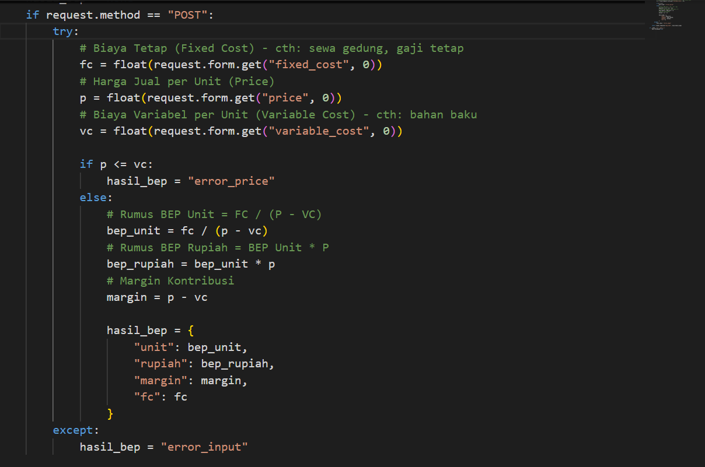
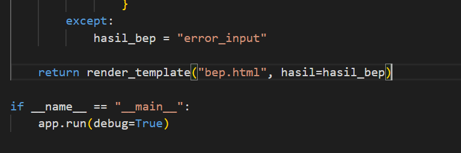
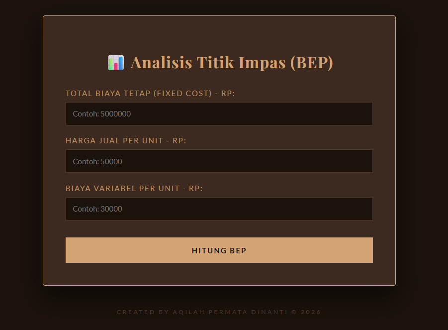

# BEP Calculator

Aplikasi ini dirancang sebagai alat bantu digital bagi pelaku usaha atau mahasiswa ekonomi untuk menentukan strategi harga dan volume penjualan. Masalah utama dalam bisnis sering kali adalah ketidaktahuan kapan sebuah usaha mulai menghasilkan keuntungan. Aplikasi ini menjawab tantangan tersebut dengan menghitung Titik Impas (Break-Even Point) secara instan dan akurat.


## Hardware Requirements (alat - alat yang akan menjadi inti dalam logika perhitungan)

- Python 3.12 
- Flask

## Instalasi app.py

1. Buat virtual environment:
   ```bash
   python -m venv envku
   ```

2. Aktifkan virtual environment:
   - Windows:
   ```bash
   envku\Scripts\activate
   ```

3. Install dependencies:
   ```bash
   pip install flask 
   ```

4. pengaktifan modul flask (fondasi awal)

from flask import flask (ini adalah untuk mengimpor library flask)
render_template (untuk menampilkan file html) 
request (untuk menangkap data dari form)

app = Flask(__name__) ini adalah sebagai pusat kendali untuk logika aplikasi web 

5. Penjelasan code python dalam mekanisme input dan output BEP Calculator 

@app.route("/", methods=["GET", "POST"])
def home():
    hasil_bep = None

Penjelasan : di @app.route("/", methods=["GET", "POST"]) ini adalah penetapan protokol akses. program menetapkan alat utama (/) sebagai pintu dari komunikasi. penggunaan methods adalah sebagai penyaring interaksi user, apakah pengguna hanya sekedar mengakses informasi (GET) atau sedang melakukan pengiriman data untuk diproses oleh sistem (POST). def home() berfungsi sebagai pengendali yang menampung semua algoritma perhitungan. hasil_bep = none ini adalah variabel yang di deklarasikan paling pertama agar dapat menghindari data lain atau sisa perhitungan sebelumnya yg di muat oleh pengguna. 

 

Program akan diproses dengan kondisi if request.method == "POST": yang berarti kode ini akan dijalankan ketika pengguna memasukkan data melalui form (POST) untuk mengantisipasi agar tidak terjadi error pada saat pengolahan data maka digunakan try, selanjutnya program akan mengambil data atau nilai dari form seperti fixed cost, price, dan variabel cost. Semua data ini diubah menjadi float agar dapat digunakan melalui perhitungan matematis. 

Setelah mendapatkan data dari pengguna, program dapat melakukan verifikasi data. jika if p <= vc: (harga jual lebih kecil atau sama dengan biaya variabel)  karena kondisi tidak masuk akal, maka program tidak melanjutkan perhitungan dan mengembalikan nilai "error_price" 

namun jika p > vc maka proses perhitungan program akan dijalankan, dengan menggunakan rumus - rumus BEP : 

# Rumus BEP 
               # Rumus BEP Unit 
                bep_unit = fc / (p - vc) 
                # Rumus BEP Rupiah = BEP Unit * P
                bep_rupiah = bep_unit * p
                # Margin Kontribusi
                margin = p - vc

Setelah data di olah dengan rumus - rumus tersebut, hasil dari BEP akan dimasukkan ke Dictionary yang berjudul hasil_bep : 

hasil_bep = {
                    "unit": bep_unit,
                    "rupiah": bep_rupiah,
                    "margin": margin,
                    "fc": fc
                }

Hasil data dari perhitungan ini akan ditampilkan ke pengguna dengan menggunakan template HTML (BEP_HTML)



Bagian except adalah hubungan dari blok try sebelumnya yang berfungsi untuk menangkap segala kesalahan input data maupun dalam perhitungan data (error), dan jika terjadi hal kesalahan output muncul di variabel hasil_bep akan diisi oleh "error_input"

return render_template fungsi ini bertujuan untuk menampilkan halaman html kepada pengguna, dan variabel hasil_bep yang akan dikirim ke template tersebut dengan nama hasil. Nantinya di dalam file HTML akan mengeluarkan output saat hasil perhitungan bep atau menampilkan pesan error jika ada kesalahan. ini adalah bentuk penghubung antara logika backend dengan tampilan frontend. dan 

 if __name__ == "__main__": app.run(debug=True) Kode ini berfungsi untuk menjalankan aplikasi web menggunakan Flask hanya ketika file dijalankan secara langsung (bukan di-import dari file lain). Saat dijalankan, aplikasi akan berjalan dalam mode `debug=True`, yang memungkinkan pengembang melihat pesan error secara detail dan membuat server otomatis memperbarui (reload) setiap kali ada perubahan kode, sehingga memudahkan proses pengembangan.

## Hasil Dari Code Python Dan Sistem Operasi Singkat (BEP CALCULATOR)

Berikut tampilan hasil dari kode program BEP CALCULATOR, kalkulator ini bertujuan untuk bagi para UMKM ataupun sebuah perusahaan dapat menggunakan kalkulator ini sebagai alat bantu untuk menentukan kapan mereka akan mendapatkan keuntungan. Menggunakan kalkulator ini sangatlah mudah, pengguna cukup memasukkan biaya tetap (sewa gedung, gaji karyawan tetap), biaya jual per unit, biaya variabel (bahan baku), Keunggulan dari sistem ini terletak pada kemampuannya dalam melakukan validasi input secara langsung. Aplikasi akan mendeteksi jika pengguna memasukkan data yang tidak sesuai, seperti huruf pada kolom angka, dan secara otomatis menampilkan pesan kesalahan. Selain itu, sistem juga memastikan logika bisnis tetap terpenuhi, misalnya dengan menolak kondisi ketika harga jual lebih kecil atau sama dengan biaya variabel karena hal tersebut tidak memungkinkan tercapainya keuntungan. 



ini tampilannya dan dapat di akses di http://127.0.0.1:5000 


